> 🌐 **زبان:** فارسی | [English](README.md)

# 📚 آموزش جامع سئو — از صفر تا صد

> این فایل آموزشی سئو را از ابتدایی‌ترین مفاهیم تا پیشرفته‌ترین تکنیک‌های حرفه‌ای به زبان ساده فارسی با اصطلاحات تخصصی توضیح می‌دهد.

---

## 🗺️ نقشه راه یادگیری

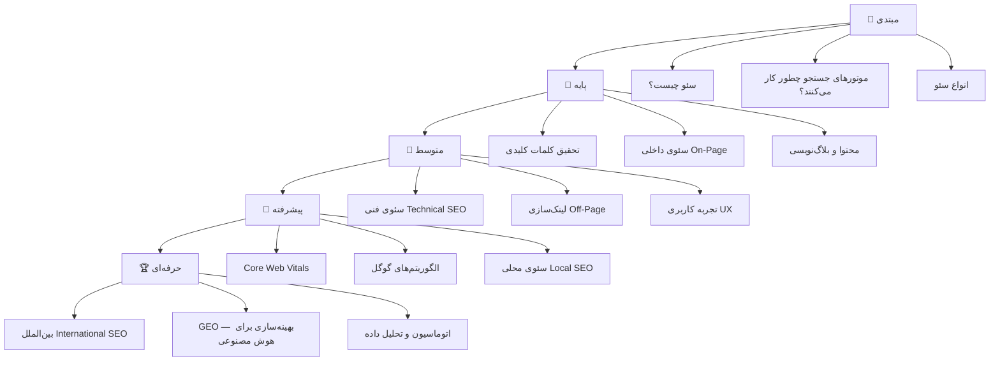

---

# 🌱 سطح اول: مبتدی

---

## ۱. سئو چیست و چرا مهم است؟

### تعریف ساده
**سئو (SEO)** مخفف **Search Engine Optimization** یعنی **بهینه‌سازی برای موتورهای جستجو**.

وقتی در گوگل چیزی سرچ می‌کنی، هزاران سایت دارند برای جای اول تلاش می‌کنند. سئو یعنی کاری کنیم که سایت ما اول نشان داده شود.

### چرا اهمیت دارد؟

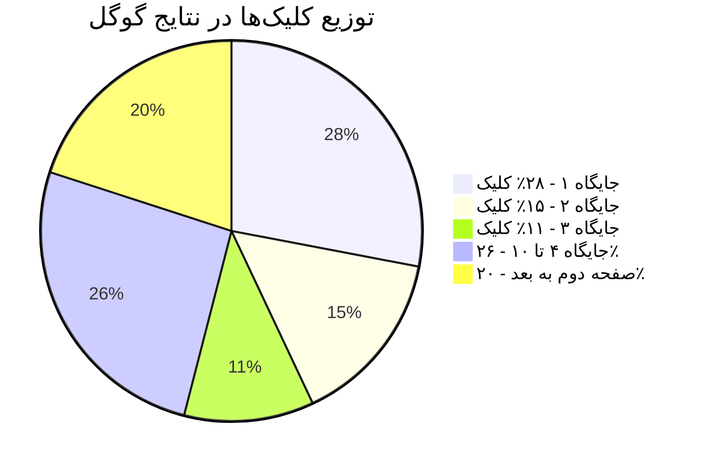

**نکته مهم:** بیش از ۷۵٪ کاربران هرگز از صفحه اول گوگل رد نمی‌شوند!

### انواع ترافیک وب‌سایت

| نوع ترافیک | معنی | رایگان؟ |
|---|---|---|
| **Organic Traffic** (ترافیک ارگانیک) | از نتایج طبیعی گوگل | ✅ بله |
| **Paid Traffic** (ترافیک پولی) | از تبلیغات گوگل (Google Ads) | ❌ خیر |
| **Direct Traffic** (ترافیک مستقیم) | تایپ کردن آدرس | ✅ بله |
| **Referral Traffic** (ترافیک ارجاعی) | از لینک سایت‌های دیگر | ✅ بله |
| **Social Traffic** (ترافیک اجتماعی) | از شبکه‌های اجتماعی | ✅ بله |

---

## ۲. موتور جستجو چطور کار می‌کند؟

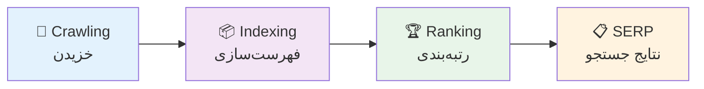

### مرحله ۱: خزیدن (Crawling)
گوگل ربات‌هایی دارد به نام **Googlebot** که مثل یک عنکبوت روی اینترنت می‌گردند و صفحات را پیدا می‌کنند.

### مرحله ۲: فهرست‌سازی (Indexing)
صفحاتی که ربات پیدا می‌کند را در یک پایگاه داده بزرگ ذخیره می‌کند. به این پایگاه داده **Index** (فهرست) می‌گویند.

### مرحله ۳: رتبه‌بندی (Ranking)
وقتی کسی چیزی سرچ می‌کند، گوگل از بین میلیون‌ها صفحه فهرست‌شده، بهترین‌ها را با الگوریتم‌هایش رتبه‌بندی می‌کند.

---

## ۳. سه نوع اصلی سئو

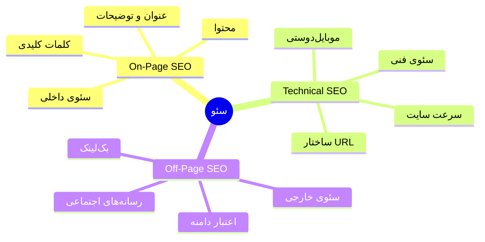

---

# 📖 سطح دوم: پایه

---

## ۴. تحقیق کلمات کلیدی (Keyword Research)

### کلمه کلیدی چیست؟
**کلمه کلیدی (Keyword)** همان چیزی است که کاربر در گوگل تایپ می‌کند. مثلاً «خرید گوشی سامسونگ» یا «بهترین رستوران تهران».

### انواع کلمات کلیدی

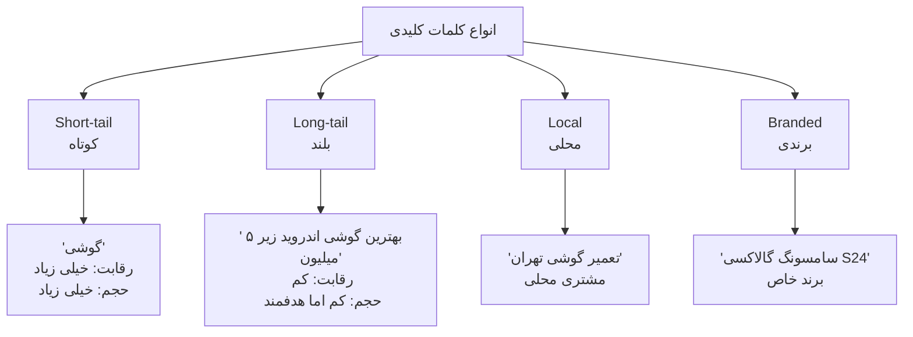

### هدف جستجو (Search Intent)
مهم‌ترین مفهوم در تحقیق کلمات! باید بفهمیم کاربر **چه می‌خواهد**:

| هدف | مثال | چه محتوایی بنویسیم؟ |
|---|---|---|
| **Informational** (اطلاعاتی) | «سئو چیست» | مقاله آموزشی |
| **Navigational** (ناوبری) | «ورود به گوگل آنالیتیکس» | صفحه لندینگ |
| **Transactional** (خرید) | «خرید دوره سئو» | صفحه محصول |
| **Commercial** (تحقیق قبل از خرید) | «بهترین دوره سئو» | مقاله مقایسه‌ای |

### ابزارهای تحقیق کلمات کلیدی

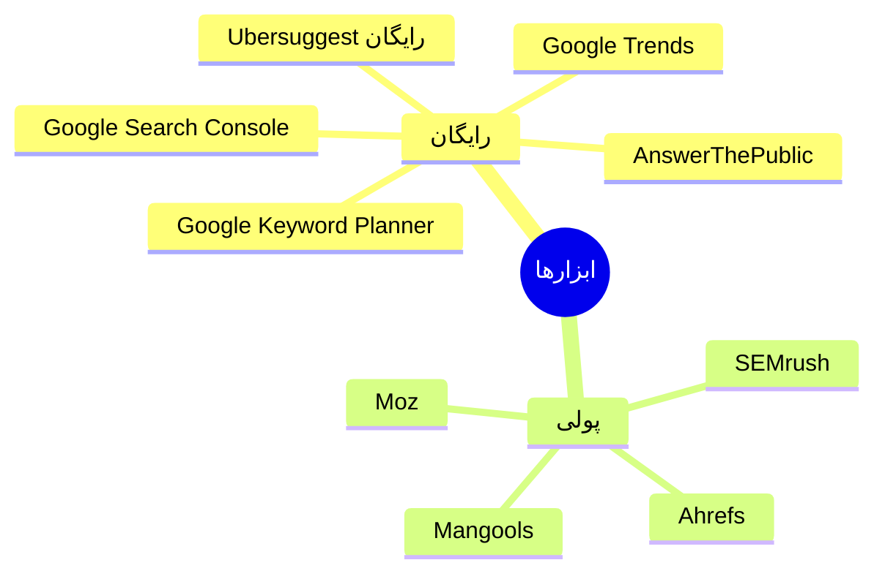

### چطور کلمه کلیدی خوب انتخاب کنیم؟

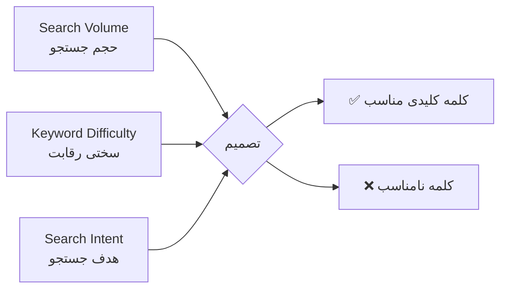

**فرمول ساده:** حجم بالا + رقابت کم + هدف مشخص = طلا! 🥇

---

## ۵. سئوی داخلی (On-Page SEO)

### عناصر اصلی یک صفحه بهینه

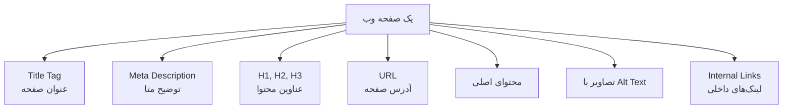

### ۱. تگ عنوان (Title Tag)
مهم‌ترین عامل سئوی داخلی! این چیزی است که در نتایج گوگل نشان داده می‌شود.

**قوانین:**
- ۵۰ تا ۶۰ کاراکتر
- کلمه کلیدی اصلی در اول
- منحصربه‌فرد برای هر صفحه
- جذاب برای کلیک

```
❌ بد:    صفحه اصلی - وب‌سایت ما
✅ خوب:  آموزش سئو رایگان | کامل‌ترین راهنمای سئو فارسی ۱۴۰۴
```

### ۲. توضیح متا (Meta Description)
زیر عنوان در گوگل نشان داده می‌شود. مستقیم روی رتبه تأثیر نمی‌گذارد اما روی **نرخ کلیک (CTR)** تأثیر دارد.

- ۱۵۰ تا ۱۶۰ کاراکتر
- شامل کلمه کلیدی
- دارای **Call to Action** (مثلاً: «الان بخوانید»، «رایگان دانلود کنید»)

### ۳. ساختار عناوین (Heading Structure)
```
H1 — فقط یک عنوان اصلی در هر صفحه
  H2 — بخش‌های اصلی مقاله
    H3 — زیربخش‌ها
      H4 — جزئیات بیشتر
```

### ۴. بهینه‌سازی URL
```
❌ بد:    yoursite.com/page?id=123&cat=4
✅ خوب:  yoursite.com/آموزش-سئو
✅ خوب:  yoursite.com/seo-tutorial
```

---

## ۶. نوشتن محتوای سئو شده

### محتوای خوب چه ویژگی‌هایی دارد؟

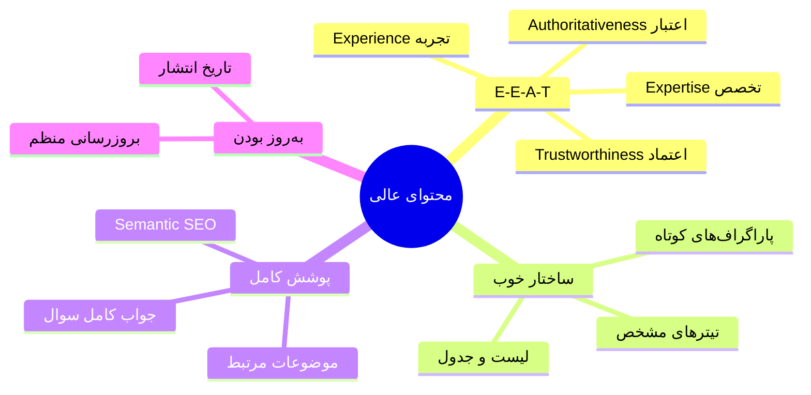

### **E-E-A-T** چیست؟
گوگل محتوا را با این چهار معیار می‌سنجد:

| حرف | معنی فارسی | مثال |
|---|---|---|
| **E** | Experience — تجربه | نویسنده واقعاً این کار را کرده؟ |
| **E** | Expertise — تخصص | نویسنده متخصص است؟ |
| **A** | Authoritativeness — اعتبار | سایت در حوزه‌اش معتبر است؟ |
| **T** | Trustworthiness — اعتماد | سایت قابل اعتماد است؟ |

### چطور محتوا بنویسیم؟

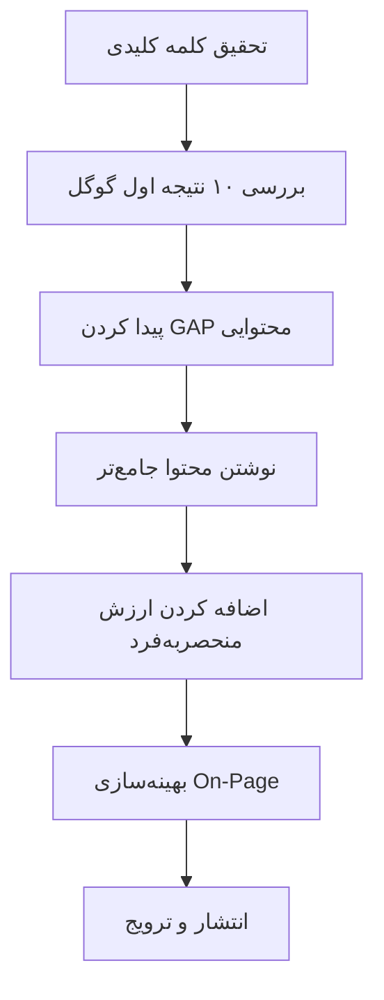

---

# 🔧 سطح سوم: متوسط

---

## ۷. سئوی فنی (Technical SEO)

### چرا سئوی فنی مهم است؟
محتوای عالی داری ولی سایتت به درستی ایندکس نمی‌شود؟ سئوی فنی را بررسی کن!

### ۱. سرعت سایت (Page Speed)

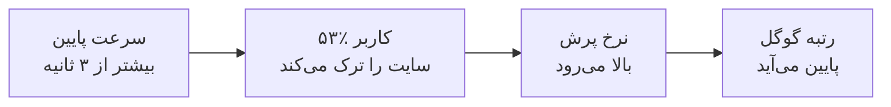

**روش‌های بهبود سرعت:**
- **فشرده‌سازی تصاویر** — از فرمت WebP استفاده کن
- **Lazy Loading** — تصاویر پایین صفحه دیر لود شوند
- **CDN** — استفاده از شبکه توزیع محتوا
- **Cache** — ذخیره موقت در مرورگر کاربر
- **Minify CSS/JS** — حذف فضاهای اضافی در کدها

### ۲. موبایل‌دوستی (Mobile-Friendliness)
بیش از ۶۰٪ جستجوها از موبایل انجام می‌شود. گوگل از **Mobile-First Indexing** استفاده می‌کند یعنی نسخه موبایل سایت را اصلی می‌داند.

### ۳. HTTPS و امنیت
سایت‌های بدون **SSL Certificate** (بدون HTTPS) توسط گوگل کمتر رتبه می‌گیرند.

### ۴. فایل Sitemap.xml
نقشه سایت به گوگل کمک می‌کند همه صفحات سایت را پیدا کند.

```xml
<?xml version="1.0" encoding="UTF-8"?>
<urlset xmlns="http://www.sitemaps.org/schemas/sitemap/0.9">
  <url>
    <loc>https://yoursite.com/</loc>
    <lastmod>2024-01-01</lastmod>
    <priority>1.0</priority>
  </url>
</urlset>
```

### ۵. فایل Robots.txt
به ربات‌های گوگل می‌گوییم کجا برود و کجا نرود:

```
User-agent: *
Disallow: /admin/
Disallow: /private/
Allow: /
Sitemap: https://yoursite.com/sitemap.xml
```

### ۶. داده‌های ساختارمند (Schema Markup / Structured Data)
کدی است که به گوگل می‌گوییم صفحه ما درباره چه چیزی است. باعث نشان داده شدن **Rich Snippets** (نتایج غنی) می‌شود.

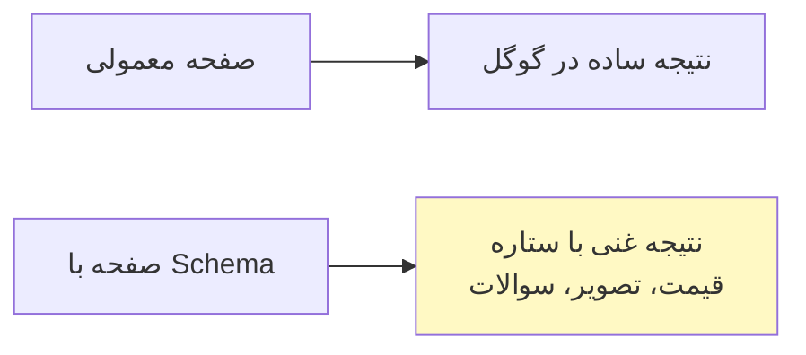

**انواع Schema:**
- `Article` — برای مقالات
- `Product` — برای محصولات
- `FAQ` — برای سوالات متداول
- `Recipe` — برای دستور پخت
- `LocalBusiness` — برای کسب‌وکارهای محلی
- `HowTo` — برای آموزش‌ها

---

## ۸. لینک‌سازی (Link Building)

### لینک چرا مهم است؟
گوگل هر لینک از سایت دیگر به سایت تو را مثل یک **رأی اعتماد** می‌بیند. هرچه لینک‌های بیشتر و باکیفیت‌تری داشته باشی، اعتبار (Authority) بیشتری کسب می‌کنی.

### انواع لینک

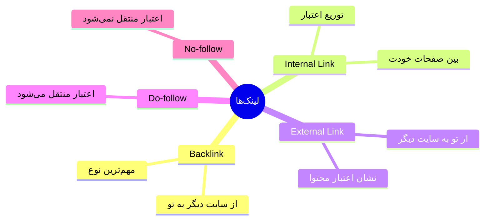

### معیارهای کیفیت لینک

| معیار | توضیح |
|---|---|
| **Domain Authority (DA)** | اعتبار کلی دامنه (۰ تا ۱۰۰) |
| **Page Authority (PA)** | اعتبار صفحه خاص |
| **Relevancy** | ربط موضوعی سایت لینک‌دهنده |
| **Anchor Text** | متن کلیکی لینک |
| **Link Placement** | جایگاه لینک در صفحه |

### روش‌های لینک‌سازی سالم (White Hat)

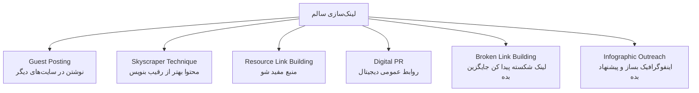

---

## ۹. تجربه کاربری (UX) و سئو

### گوگل به تجربه کاربر توجه می‌کند!

**سیگنال‌های رفتاری کاربر:**

| سیگنال | معنی | اثر بر سئو |
|---|---|---|
| **CTR** (نرخ کلیک) | چند نفر روی نتیجه کلیک می‌کنند | مستقیم |
| **Dwell Time** | چه مدت در سایت می‌مانند | مثبت |
| **Bounce Rate** | آیا سریع برمی‌گردند؟ | منفی |
| **Pogo-sticking** | برمی‌گردند و نتیجه دیگری انتخاب می‌کنند | خیلی منفی |

---

# 🚀 سطح چهارم: پیشرفته

---

## ۱۰. Core Web Vitals — معیارهای کلیدی وب

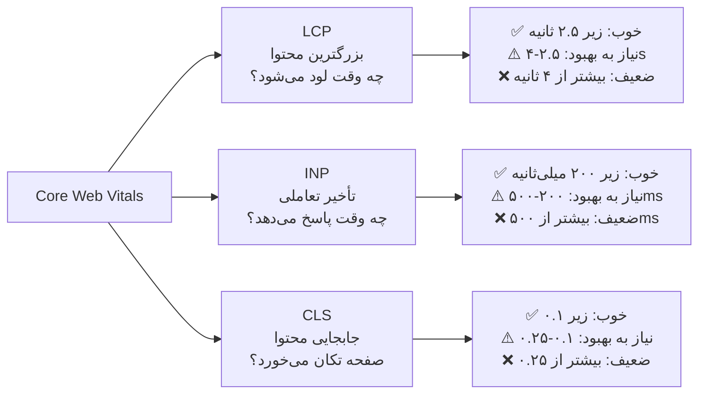

### چطور Core Web Vitals را اندازه بگیریم؟
- **Google PageSpeed Insights** — رایگان و آسان
- **Google Search Console** — گزارش Core Web Vitals
- **Chrome DevTools** — برای توسعه‌دهندگان
- **Lighthouse** — در مرورگر کروم

---

## ۱۱. الگوریتم‌های مهم گوگل

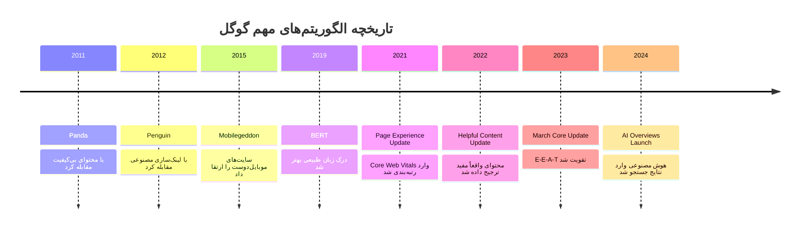

### الگوریتم‌های مهم توضیح ساده

**Panda (پاندا):** اگر محتوا کم‌کیفیت، کپی‌شده یا پر از کلمات کلیدی باشد، رتبه افت می‌کند.

**Penguin (پنگوئن):** اگر لینک‌های مصنوعی بخری یا در شبکه‌های لینکی شرکت کنی، جریمه می‌شوی.

**BERT (برت):** گوگل حالا زبان طبیعی را خیلی بهتر می‌فهمد. فقط برای ربات ننویس، برای انسان بنویس!

**Helpful Content Update:** محتوایی که واقعاً برای انسان مفید است، نه فقط برای گوگل بهینه‌شده، ارتقا پیدا می‌کند.

---

## ۱۲. ویژگی‌های خاص نتایج جستجو (SERP Features)

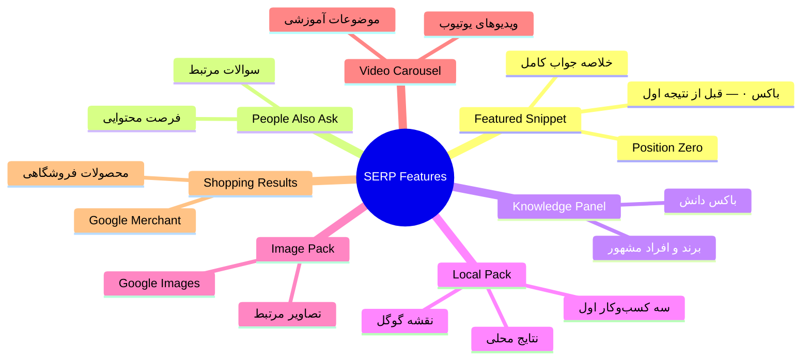

### چطور Featured Snippet بگیریم؟
۱. سوالی را که کاربران می‌پرسند پیدا کن
۲. یک پاراگراف ۴۰-۶۰ کلمه‌ای جواب مستقیم بنویس
۳. بقیه مقاله را با جزئیات بیشتر کامل کن
۴. از **Schema FAQ** استفاده کن

---

## ۱۳. سئوی محلی (Local SEO)

### برای کسب‌وکارهای محلی ضروری است!

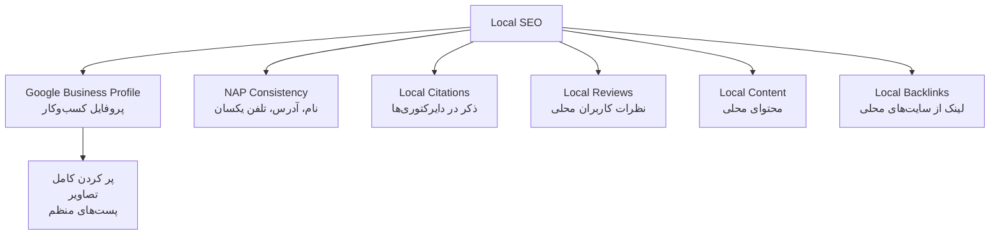

### Google Business Profile (گوگل بیزینس پروفایل)
رایگان‌ترین و قوی‌ترین ابزار سئوی محلی:
- نام کامل کسب‌وکار
- آدرس دقیق
- شماره تلفن
- ساعت کاری
- دسته‌بندی مناسب
- تصاویر باکیفیت
- پاسخ به نظرات کاربران

---

## ۱۴. تحلیل رقبا (Competitor Analysis)

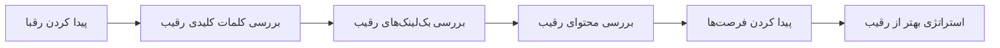

**سوالاتی که باید بپرسی:**
- رقیبم برای چه کلماتی رتبه دارد که من ندارم؟
- از کجا لینک می‌گیرد؟
- چه نوع محتایی دارد؟
- چه خلأهایی در محتوایش وجود دارد که من می‌توانم پر کنم؟

---

# 🏆 سطح پنجم: حرفه‌ای

---

## ۱۵. سئوی بین‌المللی (International SEO)

### اگر می‌خواهی چند کشور را هدف بگیری:

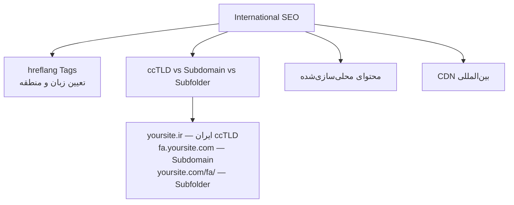

### تگ hreflang
به گوگل می‌گوید کدام نسخه سایت برای کدام کشور است:
```html
<link rel="alternate" hreflang="fa" href="https://yoursite.com/fa/" />
<link rel="alternate" hreflang="en" href="https://yoursite.com/en/" />
<link rel="alternate" hreflang="ar" href="https://yoursite.com/ar/" />
```

---

## ۱۶. گوگل آنالیتیکس و سرچ کنسول

### ابزارهای اندازه‌گیری

```mermaid
mindmap
  root((اندازه‌گیری))
    Google Search Console
      کلمات کلیدی واقعی
      کلیک و نمایش
      خطاهای ایندکس
      Core Web Vitals
    Google Analytics 4
      ترافیک سایت
      رفتار کاربران
      نرخ تبدیل
      منابع ترافیک
    Ahrefs / SEMrush
      رتبه‌بندی کلمات
      پروفایل بک‌لینک
      تحلیل رقبا
```

### KPI های مهم سئو

| شاخص | معنی | ابزار |
|---|---|---|
| **Organic Traffic** | بازدید از گوگل | GA4 |
| **Keyword Rankings** | رتبه کلمات کلیدی | GSC / Ahrefs |
| **CTR** | نرخ کلیک در نتایج | GSC |
| **Impressions** | تعداد نمایش | GSC |
| **Domain Rating (DR)** | اعتبار دامنه | Ahrefs |
| **Backlinks** | تعداد بک‌لینک | Ahrefs |
| **Core Web Vitals** | سرعت و تجربه | GSC |
| **Conversions** | تبدیل بازدیدکننده به مشتری | GA4 |

---

## ۱۷. سئو برای هوش مصنوعی — GEO

### GEO (Generative Engine Optimization) چیست؟

```mermaid
flowchart TD
    A[جستجوی سنتی\nگوگل ۲۰۰۰-۲۰۲۳] --> B[کاربر کلمه‌ای سرچ می‌کند]
    B --> C[لیست لینک‌ها نشان داده می‌شود]
    C --> D[کاربر روی لینک کلیک می‌کند]

    E[جستجوی هوش مصنوعی\nاز ۲۰۲۳ به بعد] --> F[کاربر سوال می‌پرسد]
    F --> G[هوش مصنوعی جواب می‌دهد]
    G --> H[گاهی منبع ذکر می‌شود]

    style A fill:#e3f2fd
    style E fill:#e8f5e9
```

**GEO** یعنی بهینه‌سازی محتوا برای این که هوش مصنوعی (ChatGPT، Perplexity، Google AI Overviews) ما را به عنوان منبع انتخاب کند.

### پلتفرم‌های GEO

| پلتفرم | نوع |
|---|---|
| **Google AI Overviews** | نمایش AI قبل از نتایج |
| **ChatGPT Search** | جستجوی هوش مصنوعی |
| **Perplexity AI** | موتور جستجوی AI |
| **Microsoft Copilot** | جستجو با Bing AI |
| **Claude** | دستیار AI آنتروپیک |

### استراتژی‌های GEO

```mermaid
mindmap
  root((GEO))
    محتوای اتوریتی
      منابع معتبر ذکر کن
      آمار و ارقام واقعی
      تحقیقات علمی
    ساختار واضح
      سوال و جواب مستقیم
      FAQ Schema
      محتوای خلاصه‌پذیر
    برند قوی
      ذکر برند در سایت‌های دیگر
      Wikipedia
      رسانه‌های معتبر
    داده‌های ساختارمند
      Schema Markup کامل
      Open Graph
      JSON-LD
    تازگی محتوا
      به‌روزرسانی منظم
      اخبار و آمار جدید
      تاریخ‌های واضح
```

### تفاوت SEO با GEO

| جنبه | SEO سنتی | GEO |
|---|---|---|
| هدف | رتبه در لیست لینک‌ها | ذکر شدن در جواب AI |
| معیار موفقیت | رتبه کلمه کلیدی | Mention در AI |
| نوع محتوا | بهینه برای کروال | قابل استناد و معتبر |
| Backlink | خیلی مهم | مهم + ذکر در منابع |
| ساختار | H1-H6، Schema | جواب مستقیم، FAQ |

---

## ۱۸. اتوماسیون و ابزارهای پیشرفته

### Programmatic SEO
ایجاد هزاران صفحه به صورت خودکار از یک قالب + پایگاه داده.

مثال: **Airbnb** — یک صفحه برای هر شهر + هر نوع خانه = میلیون‌ها صفحه!

```mermaid
flowchart LR
    A[Template\nقالب HTML] --> C[Page Generator]
    B[Database\nهزاران رکورد] --> C
    C --> D[هزاران صفحه SEO شده]
```

### AI در سئو

| کاربرد | ابزار |
|---|---|
| **تولید محتوا** | ChatGPT، Claude، Jasper |
| **تحقیق کلمات** | Ahrefs AI، SEMrush AI |
| **تحلیل رقبا** | Similarweb، BrightEdge |
| **تولید Schema** | Schema.dev، Merkle |
| **بهینه‌سازی محتوا** | Clearscope، Surfer SEO |
| **گزارش‌دهی** | Looker Studio، Power BI |

---

## ۱۹. استراتژی محتوا (Content Strategy)

### مدل Topical Authority (اقتدار موضوعی)

```mermaid
flowchart TD
    A[Pillar Page\nصفحه ستونی\nموضوع کلی] --> B[Cluster Content\nمحتوای خوشه‌ای\nموضوع فرعی ۱]
    A --> C[Cluster Content\nموضوع فرعی ۲]
    A --> D[Cluster Content\nموضوع فرعی ۳]
    A --> E[Cluster Content\nموضوع فرعی ۴]

    B --> A
    C --> A
    D --> A
    E --> A
```

**مثال:**
- Pillar: «راهنمای کامل سئو»
- Cluster: «تحقیق کلمات کلیدی» — «سئوی فنی» — «لینک‌سازی» — «سئوی محلی»

### تقویم محتوا (Content Calendar)

```mermaid
gantt
    title تقویم محتوایی یک ماهه
    dateFormat  YYYY-MM-DD
    section هفته ۱
    تحقیق کلمات          :done, 2024-01-01, 2d
    نوشتن مقاله اصلی     :active, 2024-01-03, 3d
    section هفته ۲
    بهینه‌سازی On-Page   :2024-01-08, 2d
    انتشار و پروموشن     :2024-01-10, 2d
    section هفته ۳
    لینک‌سازی            :2024-01-15, 5d
    section هفته ۴
    آنالیز نتایج         :2024-01-22, 3d
    بروزرسانی محتوا      :2024-01-25, 2d
```

---

## ۲۰. سئوی فروشگاه‌های اینترنتی (E-commerce SEO)

```mermaid
mindmap
  root((E-commerce SEO))
    صفحه محصول
      عنوان منحصربه‌فرد
      توضیح غنی
      تصاویر بهینه
      Product Schema
      نظرات کاربران
    دسته‌بندی
      URL بهینه
      محتوای دسته
      Faceted Navigation
    فنی
      Canonical Tags
      Pagination
      Site Speed
      Mobile UX
    محتوا
      بلاگ محصولات
      راهنمای خرید
      مقایسه محصولات
```

---

## ۲۱. چک‌لیست جامع سئو

### ✅ چک‌لیست Technical SEO

```mermaid
flowchart TD
    A[Technical SEO Audit] --> B{HTTPS?}
    B -- بله --> C{Mobile-friendly?}
    B -- خیر --> B1[نصب SSL Certificate]
    C -- بله --> D{Sitemap.xml?}
    C -- خیر --> C1[طراحی ریسپانسیو]
    D -- بله --> E{Core Web Vitals؟}
    D -- خیر --> D1[ایجاد Sitemap]
    E -- ✅ خوب --> F[پایه فنی سالم!]
    E -- ❌ ضعیف --> E1[بهبود سرعت و UX]
```

### ✅ چک‌لیست On-Page (هر صفحه)

- [ ] Title Tag شامل کلمه کلیدی (۵۰-۶۰ کاراکتر)
- [ ] Meta Description جذاب (۱۵۰-۱۶۰ کاراکتر)
- [ ] H1 منحصربه‌فرد شامل کلمه کلیدی
- [ ] URL کوتاه و توضیحی
- [ ] محتوا جامع و مفید
- [ ] تصاویر با Alt Text توصیفی
- [ ] Internal Link به صفحات مرتبط
- [ ] Schema Markup مناسب
- [ ] سرعت لود خوب

### ✅ چک‌لیست محتوا

- [ ] هدف جستجو (Search Intent) مشخص شده
- [ ] کلمات کلیدی مرتبط (LSI Keywords) استفاده شده
- [ ] محتوا از رقبا جامع‌تر است
- [ ] E-E-A-T رعایت شده
- [ ] تاریخ انتشار مشخص است
- [ ] دارای Call to Action است

---

## ۲۲. اشتباهات رایج سئو

❌ **Keyword Stuffing** — پر کردن محتوا از کلمات کلیدی
❌ **Duplicate Content** — محتوای تکراری در چند صفحه
❌ **Buying Low-Quality Backlinks** — خرید بک‌لینک بی‌کیفیت
❌ **Ignoring Mobile** — نادیده گرفتن نسخه موبایل
❌ **Slow Website** — سایت کند
❌ **Thin Content** — محتوای کم و بی‌ارزش
❌ **Cloaking** — نشان دادن محتوای متفاوت به گوگل و کاربر
❌ **Hidden Text** — متن مخفی با رنگ پس‌زمینه

---

## ۲۳. ابزارهای ضروری سئو

```mermaid
mindmap
  root((ابزارهای سئو))
    رایگان
      Google Search Console
      Google Analytics 4
      Google Keyword Planner
      Google PageSpeed Insights
      Bing Webmaster Tools
      Screaming Frog رایگان
    پولی پایه
      Ubersuggest
      Mangools
      Moz
    حرفه‌ای
      Ahrefs
      SEMrush
      Screaming Frog
      Surfer SEO
      Clearscope
    GEO & AI
      Perplexity
      ChatGPT
      Claude
      BrightEdge
```

---

## ۲۴. مسیر یادگیری پیشنهادی

```mermaid
flowchart TD
    A[شروع] --> B[هفته ۱-۲\nمفاهیم پایه\nسئو چیست\nموتور جستجو]
    B --> C[هفته ۳-۴\nتحقیق کلمات\nGoogle Keyword Planner\nSearch Intent]
    C --> D[هفته ۵-۶\nOn-Page SEO\nیک بلاگ بساز\nبهینه‌سازی تمرین کن]
    D --> E[هفته ۷-۸\nTechnical SEO\nGoogle Search Console\nPageSpeed Insights]
    E --> F[ماه ۳\nOff-Page SEO\nلینک‌سازی اولیه\nGuest Posting]
    F --> G[ماه ۴-۶\nپروژه واقعی\nنتایج ببین\nبهینه‌سازی کن]
    G --> H[ماه ۷+\nپیشرفته\nGEO\nAutomation\nAnalytics عمیق]

    style A fill:#c8e6c9
    style H fill:#fff9c4
```

---

## ۲۵. جمع‌بندی و نکات کلیدی

### ۱۰ قانون طلایی سئو

1. **محتوا پادشاه است** — مفید، جامع، و منحصربه‌فرد بنویس
2. **برای انسان بنویس، نه ربات** — گوگل دنبال محتوای طبیعی است
3. **صبر داشته باش** — سئو ۳ تا ۶ ماه زمان می‌برد
4. **از داده استفاده کن** — تصمیماتت را با Google Search Console پایه‌ریزی کن
5. **سایت سریع داشته باش** — Core Web Vitals را جدی بگیر
6. **موبایل اول** — بیش از ۶۰٪ کاربران از موبایل هستند
7. **لینک‌های باکیفیت** — یک بک‌لینک خوب از صد لینک بد ارزشمندتر است
8. **به‌روز بمان** — الگوریتم‌ها عوض می‌شوند، با اخبار سئو همراه باش
9. **رقبا را رصد کن** — همیشه بدان رقبایت چه می‌کنند
10. **GEO را فراموش نکن** — آینده جستجو با هوش مصنوعی است

### منابع یادگیری بیشتر

| منبع | زبان | رایگان؟ |
|---|---|---|
| **Google Search Central** | انگلیسی | ✅ |
| **Ahrefs Blog** | انگلیسی | ✅ |
| **Moz Beginner's Guide** | انگلیسی | ✅ |
| **SEMrush Academy** | انگلیسی | ✅ |
| **Search Engine Journal** | انگلیسی | ✅ |
| **وب‌سایت‌های فارسی معتبر سئو** | فارسی | متفاوت |

---

> **یادآوری:** سئو یک ماراتن است، نه دویدن سرعت! با پشتکار و تمرین مداوم، هر کسی می‌تواند به نتایج عالی برسد. 🚀

---

*آخرین بروزرسانی: ۱۴۰۴ | نوشته شده با ❤️ برای یادگیرندگان فارسی‌زبان*
